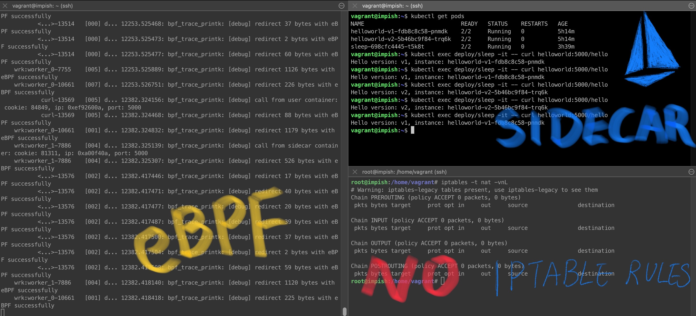

# Hoot Episode 22 - Accelerate your service mesh with eBPF and Merbridge


## Recording ##
 https://youtu.be/r2wgInmsqsU

[show notes](SHOWNOTES.md)

[slides](merbridge.pdf)

## Hands-on: Steps from the demo

Check Merbridge's [requirement on Linux Kernel](https://github.com/merbridge/merbridge/#install).

```
uname -r
# The commands below are to see if eBPF progs or functions are present in the kernel.
sudo bpftool map
sudo bpftool prog
sudo bpftool cgroup tree
```

1. Start kind cluster: 

```
kind create cluster --name merbridge
```

2. Install Istio:

```
istioctl install -y
```

Apply the sleep and the helloworld service:

```
kubectl label namespace default istio-injection=enabled
curl https://raw.githubusercontent.com/istio/istio/master/samples/sleep/sleep.yaml | kubectl apply -f -
curl https://raw.githubusercontent.com/istio/istio/master/samples/helloworld/helloworld.yaml| kubectl apply -f -
```

3. Start Merbridge
kubectl apply -f https://raw.githubusercontent.com/merbridge/merbridge/main/deploy/all-in-one.yaml

Note: if you got a crash on the merbridge pod because of cgroup, try this slightly modified yaml instead:  kubectl apply -f https://raw.githubusercontent.com/kebe7jun/merbridge/fix/failed-attach-prog/deploy/all-in-one.yaml

4. enable debug mode by adding `-d` to the merbridge daemonset:

```bash
kubectl edit ds -n istio-system merbridge
```

Output should like below:

```yaml
containers:
        - args:
        - /app/mbctl
        - -d
        - -m
        - istio
        - --ips-file
        - /host/ips/ips.txt
```

5. start to log debug info:

```
# The command to see the log, please make sure you add the -d arg to the merbridge daemonset, to get redirection fully logged.
sudo cat /sys/kernel/debug/tracing/trace_pipe
```

6. make requests:

```
kubectl exec deploy/sleep -it -- curl helloworld:5000/hello
```

7. manipulate iptables rules of sleep:

```
ps -ef | grep 3650d # grep the sleep process id
nsenter -t xxxx --net bash # enter the specific namespace, to do the iptables manipulation
```

8. after entering to the sleep process's network namespace, try the commands below to manipulate iptables:

```
iptables-save > /tmp/x # save current iptables to a file
iptables -t nat -vnL # look at iptables rules
```

try to make requests

```
kubectl exec deploy/sleep -it -- curl helloworld:5000/hello
```

9. to see if Merbridge is still working if the iptables rules are flushed. Or checkout the ISTIO_REDIRECT chain

```
iptables -t nat -F # clean up iptables rules
```

try to make requests

```
kubectl exec deploy/sleep -it -- curl helloworld:5000/hello
```

Restore the iptable rules if needed:

```
iptables-restore < /tmp/x # restore the iptables rules
```

Requests to the helloworld service should work in step 8 or 9 above, with or without IPtable rules with merbridge!