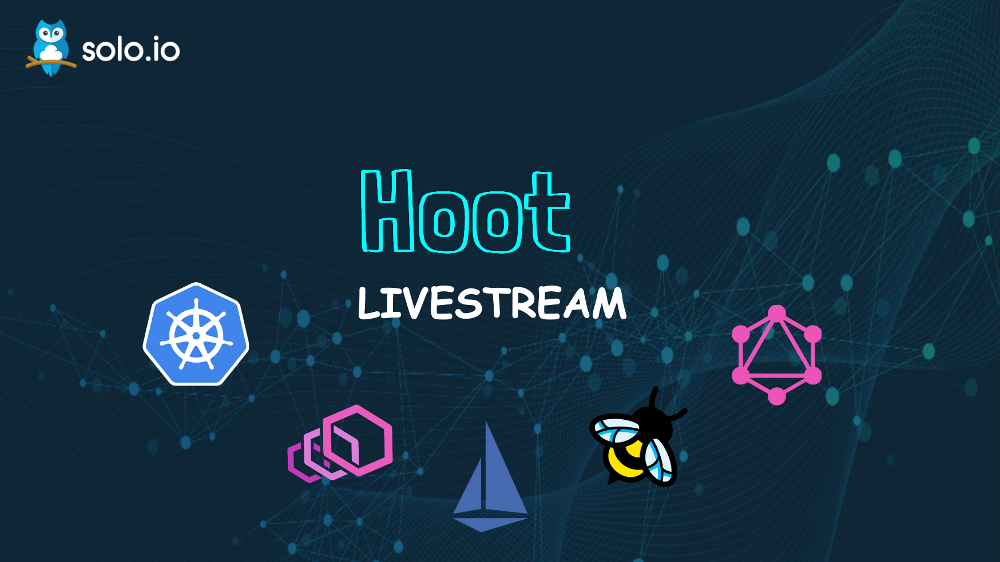

# Hoot - Learn Kubernetes, Envoy, Istio, eBPF and GraphQL
We understand it is important for you to learn Envoy, Istio, Kubernetes, eBPF and GraohQL as part of your journey to cloud native so you can make sense of any technology or architecture decision. Hoot is designed to help you learn these technologies so you can be well prepared at your job!

## Upcoming episodes

Episode #20: [1-Click Upgrade to Istio 1.13 using Helm](https://www.youtube.com/watch?v=Q3G5TEmXq7o)
- 10am PT, 1pm ET, March 15, 2022.

## Suggest a topic
Please [open an issue](https://github.com/solo-io/hoot/issues) if you have an idea for a topic we should cover or a guest we should invite.
## Previous episodes
This repo contains the code for our Hoot series:

The full playlist:
https://www.youtube.com/watch?v=xYFx0a0W9_E&list=PLBOtlFtGznBjESk9G7wHd9HWzprbJuoRS

Videos:
- Episode #1: Intro to envoy - https://www.youtube.com/watch?v=KsO4pw4tEGA
- Episode #2: Observe envoy - https://www.youtube.com/watch?v=ZthWg-_Bg_c
- Episode #3: Securing enovy - https://www.youtube.com/watch?v=TwsT7oJpEas
- Episode #4: Envoy, XDS - https://www.youtube.com/watch?v=S5Fm1Yhomc4
- Episode #5: Envoy filters - https://www.youtube.com/watch?v=Po0Z9jTECfQ
- Episode #6: Envoy WASM filters - https://www.youtube.com/watch?v=8fty-sqFyoY
- Episode #7: Into to OPA - https://www.youtube.com/watch?v=iaDuJIZj6Yw
- Episode #8: OPA + Envoy - https://www.youtube.com/watch?v=X1sdpMkHW9U
- Episode #9: GitOps + Flux - https://www.youtube.com/watch?v=KKOARkFcllU
- Episode #10: Waypoint - https://www.youtube.com/watch?v=VSr1hXPP2vQ
- Episode #11: Advanced Istio Configuration with Envoy CRDs https://www.youtube.com/watch?v=sUkeFAERvE8
- Episode #12: Hitless Deploys - https://www.youtube.com/watch?v=xYFx0a0W9_E
